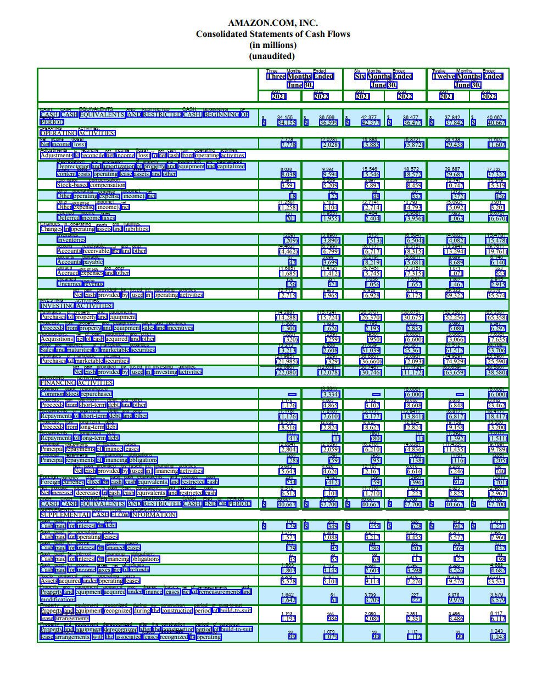

[](https://github.com/aws-samples/amazon-textract-textractor/actions/workflows/tests.yml) [](https://aws-samples.github.io/amazon-textract-textractor/) [](https://pypi.org/project/amazon-textract-textractor/) [](https://github.com/psf/black)

**Textractor** is a python package created to seamlessly work with [Amazon Textract](https://docs.aws.amazon.com/textract/latest/dg/what-is.html) a document intelligence service offering text recognition, table extraction, form processing, and much more. Whether you are making a one-off script or a complex distributed document processing pipeline, Textractor makes it easy to use Textract.

If you are looking for the other amazon-textract-* packages, you can find them using the links below:

- [amazon-textract-caller](https://github.com/aws-samples/amazon-textract-textractor/tree/master/caller) (to simplify calling Amazon Textract without additional dependencies)
- [amazon-textract-response-parser](https://pypi.org/project/amazon-textract-response-parser/) (to parse the JSON response returned by Textract APIs)
- [amazon-textract-overlayer](https://github.com/aws-samples/amazon-textract-textractor/tree/master/overlayer) (to draw bounding boxes around the document entities on the document image)
- [amazon-textract-prettyprinter](https://github.com/aws-samples/amazon-textract-textractor/tree/master/prettyprinter) (convert Amazon Textract response to CSV, text, markdown, ...)
- [amazon-textract-geofinder](https://github.com/aws-samples/amazon-textract-textractor/tree/master/tpipelinegeofinder) (extract specific information from document with methods that help navigate the document using geometry and relations, e. g. hierarchical key/value pairs)

## Installation

Textractor is available on PyPI and can be installed with `pip install amazon-textract-textractor`. By default this will install the minimal version of Textractor which is suitable for lambda execution. The following extras can be used to add features:

- `pandas` (`pip install "amazon-textract-textractor[pandas]"`) installs pandas which is used to enable DataFrame and CSV exports.
- `pdf` (`pip install "amazon-textract-textractor[pdf]"`) includes `pdf2image` and enables PDF rasterization in Textractor. Note that this is **not** necessary to call Textract with a PDF file.
- `torch` (`pip install "amazon-textract-textractor[torch]"`) includes `sentence_transformers` for better word search and matching. This will work on CPU but be noticeably slower than non-machine learning based approaches.
- `dev` (`pip install "amazon-textract-textractor[dev]"`) includes all the dependencies above and everything else needed to test the code.

You can pick several extras by separating the labels with commas like this `pip install "amazon-textract-textractor[pdf,torch]"`.

## Documentation

Generated documentation for the latest released version can be accessed here: [aws-samples.github.io/amazon-textract-textractor/](https://aws-samples.github.io/amazon-textract-textractor/)

## Examples

While a collection of simplistic examples is presented here, the documentation has a much [larger collection of examples](https://aws-samples.github.io/amazon-textract-textractor/examples.html) with specific case studies that will help you get started. 

### Setup

These two lines are all you need to use Textract. The Textractor instance can be reused across multiple requests for both synchronous and asynchronous requests.

```py
from textractor import Textractor

extractor = Textractor(profile_name="default")
```

### Text recognition

```py
# file_source can be an image, list of images, bytes or S3 path
document = extractor.detect_document_text(file_source="tests/fixtures/single-page-1.png")
print(document.lines)
#[Textractor Test, Document, Page (1), Key - Values, Name of package: Textractor, Date : 08/14/2022, Table 1, Cell 1, Cell 2, Cell 4, Cell 5, Cell 6, Cell 7, Cell 8, Cell 9, Cell 10, Cell 11, Cell 12, Cell 13, Cell 14, Cell 15, Selection Element, Selected Checkbox, Un-Selected Checkbox]
```

### Table extraction

```py
from textractor.data.constants import TextractFeatures

document = extractor.analyze_document(
	file_source="tests/fixtures/form.png",
	features=[TextractFeatures.TABLES]
)
# Saves the table in an excel document for further processing
document.tables[0].to_excel("output.xlsx")
```

### Form extraction

```py
from textractor.data.constants import TextractFeatures

document = extractor.analyze_document(
	file_source="tests/fixtures/form.png",
	features=[TextractFeatures.FORMS]
)
# Use document.get() to search for a key with fuzzy matching
document.get("email")
# [E-mail Address : johndoe@gmail.com]
```

### Analyze ID

```py
document = extractor.analyze_id(file_source="tests/fixtures/fake_id.png")
print(document.identity_documents[0].get("FIRST_NAME"))
# 'MARIA'
```

### Receipt processing (Analyze Expense)

```py
document = extractor.analyze_expense(file_source="tests/fixtures/receipt.jpg")
print(document.expense_documents[0].summary_fields.get("TOTAL")[0].text)
# '$1810.46'
```

If your use case was not covered here or if you are looking for asynchronous usage examples, see [our collection of examples](https://aws-samples.github.io/amazon-textract-textractor/examples.html).

## CLI

Textractor also comes with the `textractor` script, which supports calling, printing and overlaying directly in the terminal. 

`textractor analyze-document tests/fixtures/amzn_q2.png output.json --features TABLES --overlay TABLES`



See [the documentation](https://aws-samples.github.io/amazon-textract-textractor/commandline.html) for more examples.

## Tests

The package comes with tests that call the production Textract APIs. Running the tests will incur charges to your AWS account.

## Acknowledgements

This library was made possible by the work of Srividhya Radhakrishna ([@srividh-r](https://github.com/srividh-r)).

## Contributing

See [CONTRIBUTING.md](CONTRIBUTING.md)

## License

This library is licensed under the Apache 2.0 License.

<sub><sup>Excavator image by macrovector on Freepik</sub></sup>
